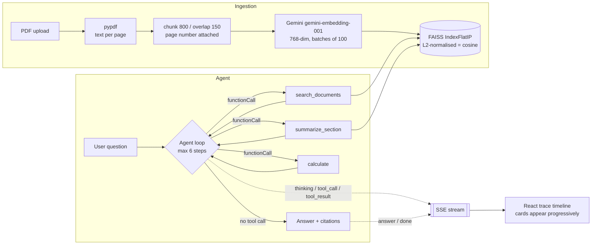

# AgentTrace

**Agentic RAG over PDFs, with the agent's reasoning streamed to the browser step by step.**

🔗 **Live demo:** _paste your deployed URL here_ · 📦 **Corpus:** AML / KYC regulatory documents

> **Demo GIF pending.** Record a ~15 second capture of the acceptance-test query,
> save it as `docs/demo.gif`, and replace this block with the line below —
> see [docs/RECORDING_THE_DEMO.md](docs/RECORDING_THE_DEMO.md).
>
> ``

---

## Why agentic, and not single-shot RAG

A conventional RAG pipeline is fixed: embed the question, retrieve the top _k_ chunks, stuff them into one prompt, return the answer. There is one retrieval and no decision, so when the first retrieval misses, nothing can recover it. AgentTrace gives the model tools and a bounded loop instead, so it can reformulate a query that came back weak, chain a calculation onto a number it just retrieved, and decide for itself when it has enough to answer. The cost is real — more latency, more tokens, and a new class of failure modes — which is exactly why every step is rendered in the UI rather than hidden behind a spinner.

---

## Architecture



Every event the loop emits is written to the response body as a `data: {json}\n\n` frame the moment it happens. The browser reads that body with `fetch` + `ReadableStream`, buffers on the blank-line delimiter, and appends one card per frame.

---

## The three tools

| Tool | Signature | What it does |
| --- | --- | --- |
| `search_documents` | `(query: str, top_k: int = 5) -> list[dict]` | Embeds the query with `RETRIEVAL_QUERY`, searches the flat index, returns chunks with `filename`, `page_num` and cosine score. The tool the agent uses most. |
| `summarize_section` | `(doc_id: str, page_start: int, page_end: int) -> str` | Concatenates a page range and compresses it in one LLM call, preserving thresholds and defined terms. Capped at 10 pages. |
| `calculate` | `(expression: str) -> float` | Evaluates one arithmetic expression through an AST allowlist. No `eval`, no `exec`. |

### On `calculate` and untrusted input

The argument to `calculate` is a string produced by a language model, which makes it untrusted user input regardless of how the prompt is worded. It is evaluated by parsing to an AST with `ast.parse(expr, mode="eval")` and walking every node against an allowlist of `Expression`, `BinOp`, `UnaryOp`, `Constant` and the arithmetic operators. `Name`, `Call`, `Attribute` and `Subscript` are absent from that list, so `__import__('os').system(...)` — a perfectly valid Python expression — is rejected during the walk, before anything is evaluated. Exponents are additionally bounded, because `9 ** 9 ** 9` is a denial of service that needs no function call at all.

---

## API

| Method | Path | Behaviour |
| --- | --- | --- |
| `POST` | `/api/upload` | multipart PDF, max 20 MB → `{doc_id, filename, num_pages, num_chunks}` |
| `GET` | `/api/documents` | `[{doc_id, filename, num_pages, num_chunks, uploaded_at}]` |
| `DELETE` | `/api/documents/{doc_id}` | Removes from the registry and rebuilds the index |
| `POST` | `/api/chat` | `{session_id, message}` → SSE stream |
| `POST` | `/api/sessions/{id}/reset` | Clears that session's conversation history |
| `GET` | `/api/health` | `{status, doc_count, model}` |
| `GET` | `/*` | Serves the React build (registered last, never shadows `/api`) |

### SSE events

```json
{"type": "thinking",    "content": "I need to find the KYC threshold first."}
{"type": "tool_call",   "call_id": "c1_0", "tool": "search_documents", "args": {"query": "KYC threshold", "top_k": 5}}
{"type": "tool_result", "call_id": "c1_0", "duration_ms": 312, "result": {"hits": 5, "top_score": 0.81, "preview": []}}
{"type": "answer",      "content": "...", "citations": [{"filename": "rbi_kyc_master_direction.pdf", "page": 3}]}
{"type": "done",        "steps": 3, "elapsed_ms": 4120, "truncated": false}
{"type": "error",       "message": "Embedding API rate limit - retry in 30s."}
```

---

## Local setup

```bash
cp .env.example .env                                    # add your GEMINI_API_KEY
pip install -r backend/requirements.txt
(cd frontend && npm install && npm run build) && cp -r frontend/dist backend/static
uvicorn backend.main:app --port 8000
```

Open http://localhost:8000. The three sample documents in `data/samples/` are embedded in the background on first boot.

For frontend development, run `uvicorn backend.main:app --port 8000` and `npm run dev` in `frontend/` side by side — Vite proxies `/api` to port 8000 and gives you hot reload.

```bash
pytest -q                                               # 4 smoke tests
python -m backend.ingest data/samples/*.pdf             # ingestion from the CLI
python scripts/make_samples.py                          # regenerate the synthetic corpus
```

### Deployment

One container, one URL. A multi-stage build compiles the React app in `node:20-slim`, then copies only `dist/` into a `python:3.11-slim` runtime that serves it from FastAPI. Splitting the frontend and backend across two hosts would double the failure surface and buy nothing but a CORS configuration.

```bash
docker build -t agenttrace .
docker run -p 7860:7860 -e GEMINI_API_KEY=... agenttrace
```

The container reads its port from `$PORT`, defaulting to 7860, so it runs unmodified on Render, Railway, Cloud Run or any other platform that injects one. Set `GEMINI_API_KEY` in the host's environment or secret store.

`scripts/deploy_render.py` deploys to Render's free tier straight from the public repo — no Docker or git needed locally, because Render builds the image server side:

```bash
python scripts/deploy_render.py --token rnd_... --repo https://github.com/<user>/agenttrace --gemini-key ...
```

Free instances sleep after 15 minutes of inactivity and take about a minute to wake, so the first request to a cold service is slow. `scripts/deploy_hf.py` automates the Hugging Face Spaces path instead, but note that Docker Spaces now require a paid HF plan.

---

## Design decisions worth defending

**`IndexFlatIP`, not HNSW or IVF.** Flat search is exhaustive, so recall is exactly 1.0. At a few thousand chunks a brute-force dot product is sub-millisecond; approximate indexes only start paying for themselves somewhere north of a million vectors, and below that they trade away recall for speed you do not need.

**Inner product on normalised vectors.** After L2 normalisation, inner product _is_ cosine similarity — the right metric for text, where direction carries the meaning and magnitude does not. Normalisation is not optional here: `gemini-embedding-001` is Matryoshka-trained and returns unnormalised vectors at any output dimension other than its native 3072, and this project truncates to 768 to keep the index small enough for a 512 MB instance.

**API embeddings, not local `sentence-transformers`.** A local model pulls roughly 800 MB of PyTorch into the image and turns every cold start into a problem on a free tier. The trade-off is a network dependency and per-call latency, and for a genuinely sensitive corpus it would flip the other way, because API embeddings mean the text leaves the machine.

**SSE, not WebSockets.** The stream is unidirectional server → client. SSE is plain HTTP, survives proxies and needs no second protocol. It is a `POST` because the request carries a body, which is why the client uses `fetch` + `ReadableStream` rather than `EventSource` — `EventSource` is GET-only.

**Step-level streaming, not token-level.** An agent run takes around twelve seconds. Streaming the final answer token by token would fill that time with nothing useful; streaming the steps fills it with what the agent is actually doing.

**A bounded loop.** `MAX_STEPS = 6`. On exhaustion the agent makes one final tool-free call and returns a partial answer flagged `truncated`, rather than erroring or looping. An unbounded agent loop is a cost incident waiting to happen.

---

## Known limitations

The document registry and the index live in process memory, so a restart loses anything uploaded at runtime — the right production answer is pgvector or Qdrant, and swapping it in means reimplementing one class. There is no auth, no multi-user isolation and no concurrency control; the app runs on a single uvicorn worker on purpose, because a second worker would serve a different corpus from its own memory.

Retrieval has no reranking stage. A cross-encoder over the top 20 candidates would measurably improve precision on this kind of dense regulatory text, and its absence is the first thing I would fix. There is also no evaluation harness — a golden set of questions scored on retrieval recall and citation accuracy is what you would need before trusting this on real filings.

Citations are enforced by the system prompt and validated against the indexed filenames, which reduces fabricated sources but does not eliminate wrong ones: the model can still attach a real page number to a claim that page does not support. Verifying each cited claim against its chunk is the natural next layer.

Extraction is text-only and English-only. Scanned PDFs yield nothing because there is no OCR, tables lose their structure when flattened to text, and running headers and footers end up inside chunks, where they add a little noise to the embeddings.

---

## Repository layout

```
agenttrace/
├── backend/
│   ├── main.py          FastAPI routes, SSE endpoint, SPA catch-all
│   ├── agent.py         the loop, system prompt, citation extraction
│   ├── tools.py         three tools + Gemini schemas + safe AST evaluator
│   ├── ingest.py        PDF → pages → chunks → embeddings
│   ├── store.py         document registry + FAISS index wrapper
│   ├── llm.py           Gemini REST client (swap this file to change provider)
│   ├── models.py        Pydantic models + SSE event envelope
│   └── requirements.txt
├── frontend/src/
│   ├── App.jsx
│   ├── components/      UploadPanel · ChatPanel · TraceTimeline · TraceStep · CitationChip
│   └── hooks/useAgentStream.js
├── data/samples/        3 synthetic AML/KYC PDFs
├── scripts/             make_samples.py · fetch_samples.py · deploy_render.py · deploy_hf.py
├── tests/test_smoke.py
└── Dockerfile
```

## Sample corpus

`data/samples/` holds three **synthetic** documents written for this repo in the register of real regulatory text — a KYC master direction, a summary of international AML recommendations, and an internal bank AML policy. Each carries a notice saying so. They exist to make the demo deterministic: the acceptance-test question has a known answer on a known page. `scripts/fetch_samples.py` pulls the authentic public documents if you would rather demo on those.

## Acceptance test

> _"What's the customer due diligence threshold, and if a bank processes 40 transactions at that exact amount, what's the total?"_

A correct run searches the corpus, finds ₹50,000 with a page citation, calls `calculate` with `50000 * 40`, returns ₹20,00,000, and shows at least three trace cards appearing one after another. Search, multi-step reasoning, tool chaining and citations in one question.

## License

MIT.
